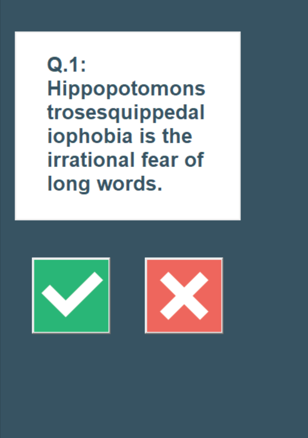
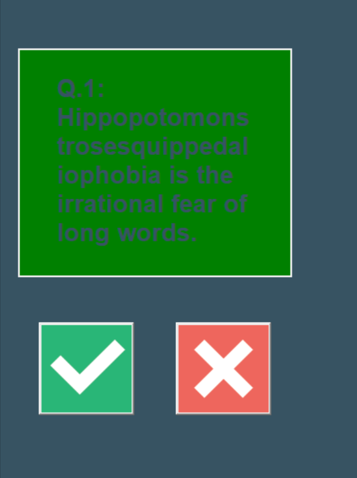
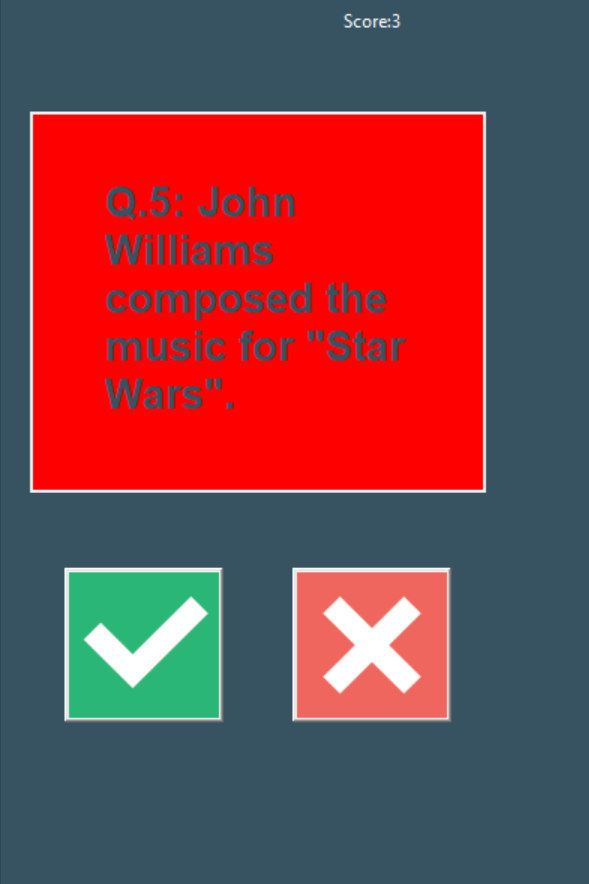

# Quizzler-App

## Overview

Quizzler is a simple quiz application built using Python and Tkinter. It presents users with questions and allows them to answer by selecting True or False. The app provides instant feedback and tracks the user's score.

## Features

- Displays multiple-choice questions.
- Tracks the user's score.
- Provides instant feedback with color changes.
- Disables buttons when the quiz ends.

## Technologies Used

- Python
- Tkinter (for GUI)
- OOP (Object-Oriented Programming)

## Installation

1. Clone the repository:
   ```sh
   git clone https://github.com/your-repo/quizzler.git
   ```
2. Navigate to the project folder:
   ```sh
   cd quizzler
   ```
3. Install dependencies (if any):
   ```sh
   pip install -r requirements.txt
   ```

## How to Run

Run the following command in your terminal:

```sh
python main.py
```

## Screenshots





